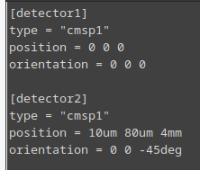
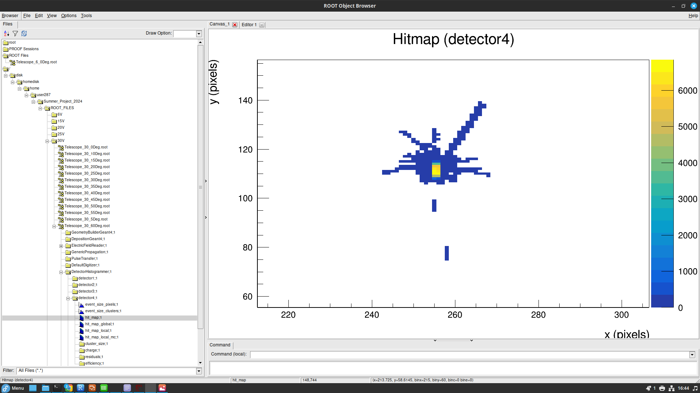

# Manual for Constructing a Sentaurus TCAD and Allpix Squared Sensor Simulation

## Introduction:

Included here is a TCAD tutorial using the Sentuarus Workbench (SWB) to simulate a series of increasingly sophisticated semiconductor sensors. Following this is an Allpix Squared tutorial, where a test beam of protons impinges on a telescope of 7, 224 x 512 pixel, monolithic sensors.

## Preliminary Set-Up for SWB:

### Downloading SWB:

First the TCAD installer must be installed:

`/disk/moose/general/TCAD/downloads/` .

Then install SynopsysInstaller_v5.7.run by running:

`./SynopsysInstaller_v5.7.run` .

Copy the downloads to a directory where you have write permissions. In the installed location of the installer. To install using installer, run the following inside where you installed the installer:

`./installer -gui` .

Side ID Number: **7789/disk/moose/general/TCAD/downloads**

Select the location of the product that you want to install under the "Source" window. For example,

`/disk/moose/general/TCAD/downloads/tcad_sentaurus_vV-2024.03` .

Ignore the not writable error and select the installation location. Now SWB should be installed on your system.

## Loading SWB:

Start up the terminal and apply the following lines to set the license:

`export SNPSLMD_LICENSE_FILE=27020@eplsv004`

`export STROOT=/scratch/synopsys/sentaurus/current/`

cd into the directory containing Sentaurus:

`cd ${STROOT}/bin/` .

Then open TCAD SWB:

`./swb` .

## Constructing an Initial SWB PN Junction:

The TCAD Sentaurus Tutorial can be found at: <file:///scratch/synopsys/sentaurus/V-2024.03/tcad/V-2024.03/Sentaurus_Training/index.html>. I would recommend reading the first module up to Section 6 (Managing Projects) to gain an idea of how to use SWB. Pay particular attention to mentions of Device Simulation, as this what we will use to measure the simulated sensor's electrical properties.

## Preliminary Set-Up for Allpix:

Allpix Squared will be used for the Monte Carlo simulation of charge carriers in the sensor modules. This software is based on Geant4 and contains functionality for visualisation. I mention this because such visualisation can be used as a sanity check that your simulation is doing what you want it to. Particularly problematic is when Allpix uses default values for specific parameters. The Allpix documentation can be found at: <https://allpix-squared.docs.cern.ch/docs/>, and contains examples of when default values are used. To open Allpix Squared, you must first move to the directory containing your Allpix configuration files (this can be your home directory). Then type the following command into the command line:

`alma9`

`source /cvmfs/clicdp.cern.ch/software/allpix-squared/3.1.0/x86_64-el9-gcc12-opt/setup.sh`

I would recommend starting by looking at the **example.conf** and **example_detector.conf** configuration files given in:

`allpix-squared/examples/` .

**example_detector.conf** gives an example of how to set up a detector's position and orientation. In this case, the type of detector is cmsp1, the design of which can be found at:

`allpix-squared/models/cmsp1`

**example.conf** describes how to initialise a simulation of 10000 events, each of which produces a 120GeV energy, 10$\mu$m thick pion beam. The pion beam is fired in the positive z-axis from position (33$\mu$m, 66$\mu$m, -500$\mu$m). For this set-up, visualisation is not included. This can be rectified by replacing the **[Ignore]** header with **[VisualizationGeant4]**. Also included is the ability to set a electron threshold for your **[DefaultDigitizer]** header. This can be used for noise suppression.

To start a full simulation, cd into the directory containing the relevant .conf file. To run the file, e.g. to run **example.conf**, type:

`allpix -c example.conf` .

Once this has run, now look for the output folder in the same directory as \<file.conf\>. If this is present, you can examine the files in the ROOT Object Browser using:

`root`

`new TBrowser`

Then navigate to the examples folder. You have now demonstrated Allpix Squared functionality. With this in mind, we can now move on to building our own sensor based on the Allpide model. To look at something like the pixel hitmap, navigative to **modules.root/DetectorHistogrammer/\<detector_number\>/hit_map**. The figure below demonstrates how this should look.

## Constructing a Sensor Test Beam Simulation:

To begin with, we take the Allpide model from the featured Allpix models and change the relevant parameters to match those in the table below.

| Parameter        | Value                     |
|------------------|---------------------------|
| Sensor Dimension | 20.2 mm x 10.1168 mm      |
| Pixel Pitch      | 36.4 $\mu$m x 36.4 $\mu$m |
| Pixel Matrix     | 512 x 224                 |
| Sensor Thickness | 100 $\mu$m                |
| Sensor Excess    | 0.7816 mm x 0.9812 mm     |

: Table of sensor parameters

Now create a detector configuration file, specifying the **alpide** as the detector type, and arranging the 7 detectors/sensors as per the table below.

| Z-axis position (mm) |
|----------------------|
| 0                    |
| 80                   |
| 160                  |
| 550                  |
| 940                  |
| 1020                 |
| 1100                 |

: Sensor z-axis positions

| Parameter              | Value   |
|------------------------|---------|
| Particle               | proton  |
| Energy                 | 180GeV  |
| Temperature            | 258.15K |
| Depletion Voltage      | -30V    |
| Digitisation Threshold | 260e    |

: Simulation operational parameters

The main simulation configuration file for this simulation is adapted from **example.conf**, which can be found here

`./allpix-squared/examples`

. You will then need to add the following line in the main simulation configuration file **[Allpix]** header:

`model_paths = "./allpix-squared/<detector_files>/"`

where \<detector_files\> is the directory where allpide is stored. This allows Allpix to know where you want it to check for pre-defined detectors. Before running your full simulation .config file, the following line must be added in the **[ROOTObjectWriter]** header:

`file_name = "./allpix-squared/<Output_File_Name.root>"`

This specifies where you want your output data to be stored. Finally, you'll need to add a **[DetectorHistogrammer]** header for the fourth detector. Now run your main simulation configuration file. Once this has completed, open a new TBrowser. Your screen should look like this:

To look for histogram data, go to PixelHit/\<detector\>/pixel/local_center\_/X(). This should demonstrate to you that the simulation was successful as it shows you the pixel hits in the X-axis. (The same logic can be applied to the Y- and Z-axis.) To look at clustering data

UNEDITED BELOW:

Sentaurus Process can be used for fabrication, while Sentaurus Structure Editor uses pre-def

alma9

source /cvmfs/clicdp.cern.ch/software/allpix-squared/3.1.0/x86_64-el9-gcc12-opt/setup.sh

ined geometries. After a structure is generated, we can create a device to measure the electrical properties. To extract values from the simulation, the simulation flow must end with a Sentaurus Visual.

NOTE: Sentaurus Workbench (SWB) comes with pre-prepared projects.

Sentaurus Interconnect potential usage for multiple connected components

Sentaurus Project tab organised from top to bottom as: Total Flow (SPROCESS, SDEVICE, SVISUAL), Project Parameters, Simulation Tree.

Nodes in the Simulation Tree contain data.

SWB projects can be organised in two ways: \* Hierarchical: core project files, and simulation results are separated \* Traditional: all project data is placed in one directory

Parallel processing will be required if a 3D simulation is constructed.

Decided to move on from Sentaurus Workbench tutorial after Section 6. Now working on to Sentaurus Structure Editor module.Can return to previous module for advice on Sentaurus preferences.

To start Sentaurus Structure Editor on the command line, type: ./sde (same as for ./swb).

To start Sentaurus Visual, type: ./svisual. Could use the Plot Overlay function in Sentaurus Visual to compare the behaviour of the simple PN junction to the rudimentary sensor module.

Sentaurus Visual command prompts can be written in tool command language (TCL) and/or python. A tutorial for this is included in the main Sentaurus tutorial. For the purposes of debugging, a knowledge of TCL basics is recommended.

NOTE: Allpix Squared also provides the possibility to utilize a full electrostatic TCAD simulation for the description of the electric field.

Root tutorial found at: <https://root.cern.ch/root/htmldoc/guides/users-guide/Trees.html>

NEW WAY TO GET INTO ALLPIX:

`apptainer shell [docker://gitlab-registry.cern.ch/allpix-squared/allpix-squared](docker://gitlab-registry.cern.ch/allpix-squared/allpix-squared)`

`apptainer shell /cvmfs/unpacked.cern.ch/gitlab-registry.cern.ch/allpix-squared/allpix-squared:latest/` .
