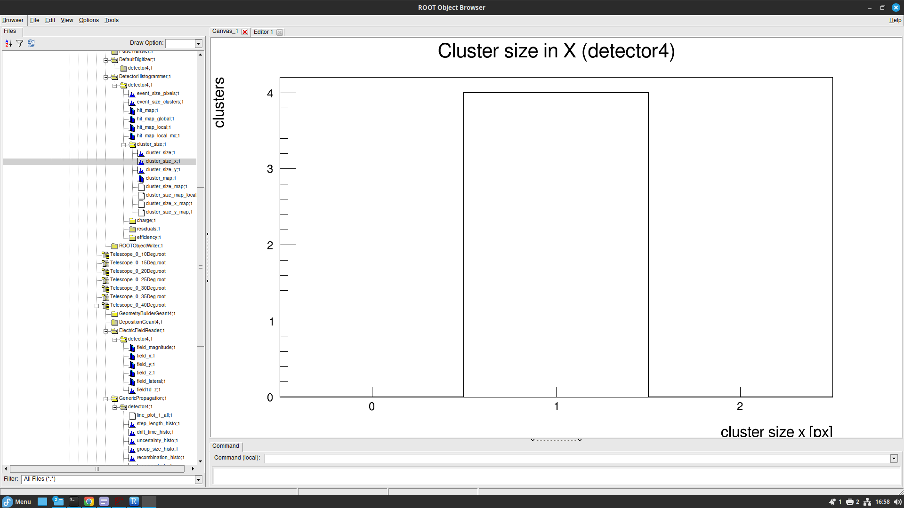

# Manual for Constructing a Sentaurus TCAD and Allpix Squared Sensor Simulation

## Introduction:

Included here is a tutorial on how to set up the Sentuarus Workbench (SWB) environment using the UoB license. This software is used to simulate a semiconductor sensors and its associated electric field model. Following this is an basic Allpix Squared tutorial where the user learns how to examine sensor parameters through ROOT TBrowers.

**NOTE: as of writing (August 2024), Sentaurus Device Editor 3D rendering not working. An update is required for this tutorial such that it includes how to use Sentaurus.**

## Preliminary Set-Up for SWB:

### Downloading SWB:

First the TCAD installer must be installed:

`/disk/moose/general/TCAD/downloads/` .

Then install SynopsysInstaller_v5.7.run by running:

`./SynopsysInstaller_v5.7.run` .

Copy the downloads to a directory where you have write permissions. In the installed location of the installer. To install using installer, run the following inside where you installed the installer:

`./installer -gui` .

Side ID Number: **7789/disk/moose/general/TCAD/downloads**.

Select the location of the product that you want to install under the "Source" window. For example,

`/disk/moose/general/TCAD/downloads/tcad_sentaurus_vV-2024.03` .

Ignore the not writable error and select the installation location. Now SWB should be installed on your system.

## Loading SWB:

Start up the terminal and apply the following lines to set the license:

`export SNPSLMD_LICENSE_FILE=27020@eplsv004`

`export STROOT=/scratch/synopsys/sentaurus/current/`

cd into the directory containing Sentaurus:

`cd ${STROOT}/bin/` .

Then open TCAD SWB:

`./swb` .

## Constructing an Initial SWB PN Junction (To be edited once SDE 3D rendering works):

The TCAD Sentaurus Tutorial can be found at: <file:///scratch/synopsys/sentaurus/V-2024.03/tcad/V-2024.03/Sentaurus_Training/index.html>. I would recommend reading the first module up to Section 6 (Managing Projects) to gain an idea of how to use SWB. Pay particular attention to mentions of Device Simulation, as this what we will use to measure the simulated sensor's electrical properties.

## Preliminary Set-Up for Allpix:

Allpix Squared is used for the Monte Carlo simulation of charge carriers in semiconductor sensor modules. This software is based on Geant4 for charge propagation and contains functionality for visualisation. I mention this because such visualisation can be used as a sanity check that your simulation is doing what you want it to. Particularly problematic is when Allpix uses default values for specific parameters. Further to that, there are some instances where the simulation will continue to run with default values, for example, if you misspell a parameter. The Allpix documentation can be found at: <https://allpix-squared.docs.cern.ch/docs/>, and contains examples of when default values are used.

To open Allpix Squared, you must first move to the directory containing your Allpix configuration files (this can be your home directory). Then type the following command into the command line:

`alma9`

`source /cvmfs/clicdp.cern.ch/software/allpix-squared/3.1.0/x86_64-el9-gcc12-opt/setup.sh`

## The Configuration Files

I would recommend starting by looking at the **example.conf** and **example_detector.conf** configuration files given in:

`allpix-squared/examples/` .

These files should be included when you initially install Allpix. **example_detector.conf** gives an example of how to set up a detector's position and orientation. In this case, the type of detector is cmsp1, the design of which can be found at:

`allpix-squared/models/cmsp1` .

Allpix Squared contains 18 different models in the models folder, ranging from the LHCb velopix detector to the ATLAS ITk. Each of these can be used as a standard, and can be edited to create a variant of a well established detector.

In **example_detector.conf** you can set the type, position, and orientation of any number of detectors. **cmps1.conf** allows you to decide whether a detector is hybrid or monolithic, pixel or strip. You can also add, in the case of hybrid, the bump-bond and the ASIC geometry. **example.conf** describes how to initialise a simulation of 10000 events, each of which produces a 120GeV energy, 10$\mu$m thick pion beam. The pion beam is fired in the positive z-axis from position (33$\mu$m, 66$\mu$m, -500$\mu$m). For this set-up, visualisation is not included. This can be rectified by replacing the **[Ignore]** header with **[VisualizationGeant4]**. Also included is the ability to set a electron threshold for your **[DefaultDigitizer]** header. This can be used for noise suppression.

## Starting a Simulation

You will then need to add the following line in the main simulation configuration file **[Allpix]** header:

`model_paths = "./allpix-squared/<detector_files>/"`

where \<detector_files\> is the directory where allpide is stored. This allows Allpix to know where you want it to check for pre-defined detectors. Before running your full simulation .config file, the following line must be added in the **[ROOTObjectWriter]** header:

`file_name = "./allpix-squared/<Output_File_Name.root>"`

This specifies where you want your output data to be stored. Finally, you'll need to add a **[DetectorHistogrammer]** header for the fourth detector.

To start a full simulation, cd into the directory containing the relevant .conf file. To run the file, e.g. to run **example.conf**, type:

`allpix -c example.conf` .

Once this has run, now look for the output folder in the same directory as \<file.conf\>. Of course, this can be set by adding

`file_name = /path/to/desired/output`

in the **[ROOTObjectWriter]** header. If your output file is present, you can examine the files in the ROOT Object Browser using:

`root`

`new TBrowser`

in your terminal.

Then navigate to the output folder. You have now demonstrated Allpix Squared functionality. With this in mind, you can now move on to building your own sensor based on the of your choosing model. To look at something like the pixel hitmap i.e. which pixels are hit and how many times they are hit, navigative to

`<output_file.root>/DetectorHistogrammer/<detector_number>/hit_map`.

The figure below demonstrates how this should look.

## Looking at Allpix Visualisation

If you look at the **[Ignore]** header and swap **[Ignore]** with **[VisualizationGeant4]**, then when you finish running a simulation, it will output the figure below (obviously with your detector geometry, not mine).

## Looking at Clustering Data:

To look for cluster histogram data, go to

`<output_file.root>/DetectorHistogrammer/<detector_number>/cluster_size/cluster_size_x`.

This should demonstrate to you that the simulation was successful as it shows you the clusters in the X-axis. (The same logic can be applied to the Y- axis.)

## Looking at the Electric Field

For the MALTA2 telescope, a linear electric field is used. To get plots like the one below to show **output_plots = true** must be applied in **[ElectricFieldReader]**. You must the go via the following path in the ROOT Browser:

`<output_file.root>/ElectricFieldReader/<detector_number>/field_magnitude` .

## Looking at Lineplots

To have lineplots in you TBrowser, you must have the following line in the **[GenericPropagation]** header:

`output_lineplots = true` .

In the TBrowser the lineplot can be found at:

`<output_file.root>/GenericPropagation/<detector_number>/line_plot_1_all`

