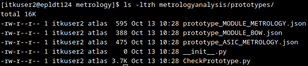

# Terminology
Directory = A folder
Working Directory = The folder you are currently working in.

## pwd
Stands for ‘print working directory,’ this command will tell you the path to your working directory.

## cd
Stands for ‘change directory,’ this command will let you change your current working directory.

If you want to go up a directory, you use ‘..’, like so:

Or you can use the entire path, rather than the local path:

## ls
This command lists the contents of a directory. By default, it will just list the contents of the working directory.

To list the contents of another directory, you need to specify the path to the directory you want to list the contents of.

You can also add in some options to make the list a bit more human-readable. I like ‘-ltrh’ which lists things in a human-readable format, in reverse order of last edited:

## mkdir
mkdir = “make directory” = make a new directory:

## rm
delete (‘remove’) something. If you’re deleting a file, you can do this with ‘rm path/to/file’. If you want to delete a directory, you need to use the -r option which enables recursive deleting ‘rm -r path/to/directory’. Beware!!! If you do this, you’ll permanently delete everything in that directory, and may well have no way to recover it, so be sure that’s what you wanted to do before doing it!

An additional note to say: if anyone tells you to do ‘rm -rf *’ or similar, they’re pranking you in the worst way – that’s the way to delete everything in this directory and every directory under it without any check for vital files.

## Additional Notes
Linux uses tab-complete for paths and file names. This can be useful, as it’s much easier to input ‘cd hyb [TAB]’ than to type out all of ‘cd hybrid_and_module_building.’
If you need to stop some code running, you can usually press “Ctrl-c” in the terminal to stop things from running. You might need to mash it a few times if the code is running several processes one after another, but it should get the job done.