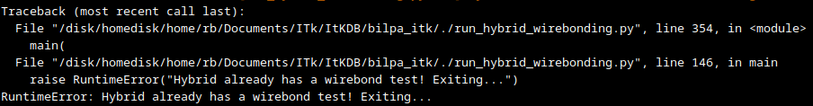

# Magic Spreadsheets

The magic spreadsheets code is stored in the directory:

```
/home/itkuser2/hybrid_and_module_building/magic_spreadsheets
```

and is split into four parts: Hybrid Gluing, Hybrid Wire Bonding, Module Gluing and Module Wire Bonding. Each of these parts has its own individual bash script.


When you run any one of these scripts, you will see colour-coded ‘logging’ messages roll past on screen. These messages are colour-coded to show you how important they are:

| Colour | Code | Description/Importance |
| ------ | ---- | ---------------------- |
| White/Grey | DEBUG | Debug message – this is usually unimportant for the average user, and is information used to work out where the code has run into problems if/when it throws an error. |
| Blue | INFO | Information message – this is an expected message, giving you some information about what the code is doing. |
| Yellow | WARNING | Warning message – this may or may not be expected, but is there to grab your attention and warn you that there is something you need to check.|

Sometimes, a warning like “Logger not passed to [something]” will appear, which indicates that you aren’t receiving the logging messages you should be getting from some bit of the code. That’s not disastrous at all, so don’t worry (unless something else goes wrong!)

Sometimes, you might get a warning like “Visual Inspection not found, uploading visual inspection.” This just means that the code is automatically uploading a visual inspection for you. The warning is to remind you to actually go and look at the thing so that the visual inspection is valid!

Sometimes, a warning will appear just before the code throws an error. This is usually some messages to indicate what went wrong for an error to be thrown. It might tell you that a test is missing, or that you are trying to duplicate a test that already exists, or that a particular component can’t be found. The message is just letting you know the problem to make it easier to fix.

You may sometimes see that the code stops with a message in white text indicating an error, which looks a bit like this:



This indicates that the code has stopped itself running for some reason, which will hopefully be explained in the error message (or prior warning messages). In this case, the cause is fairly innocuous – this hybrid already has a wirebond test, so the code has stopped itself before it tries to upload one. Other messages might indicate more serious problems, so if you’re unsure, ask someone with some python experience to help you debug the problem.

# Links
[Hybrid Assembly](./magicspreadsheets_hybridassembly.md)

[Module Assembly](./magicspreadsheets_moduleassembly.md)

[Hybrid Wire Bonding](./magicspreadsheets_hybridwirebonding.md)

[Module Wire Bonding](./magicspreadsheets_modulewirebonding.md)
